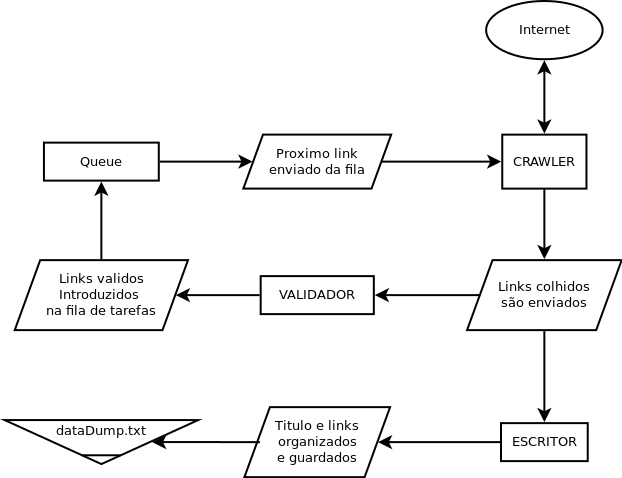
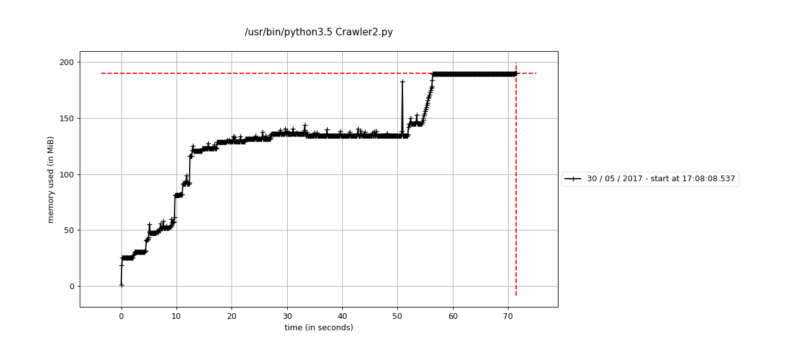
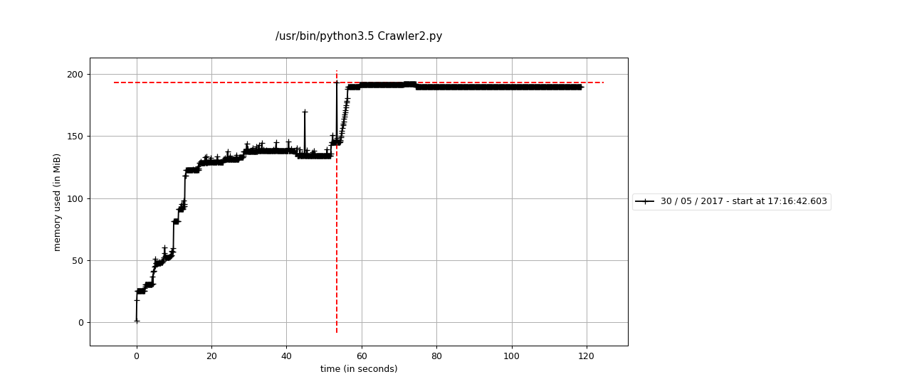

# UNIVERSIDADE DO ALGARVE

## 1st Assignement – Web crawler

#### *Julio Jacobsen Dias*


Relatório do Trabalho Prático nº 1 de Multi-Agent Sistems
Mestrado em Engenharia Elétrica e Eletrônica

Trabalho efetuado sob a coordenação de:
*__Professor Doutor Pedro Cardoso__*

2017

por fazer:
algoritmo ou fluxograma
testes de cpu, memoria e tempo

* * *

##### Tabela de conteúdos

- Introdução
- Livrarias
- Diagrama
- O Código
- Resultados
- Considerações finais e trabalhos Futuros
- Bibliografia
- Código integro

* * *

## Introdução

_ A Web crawler, sometimes called a spider, is an Internet bot that systematically browses the World Wide Web, typically for the purpose of Web indexing (web spidering)._ 
__ fonte: https://en.wikipedia.org/wiki/Web_crawler __

Web crawler é mais famoso talvez pelo trabalho do Google. O "crawler" deles varre todas as paginas da Internet regularmente para saber como fazer as buscas mais relevantes para os usuários. O "crawler" realiza um "scrape" para coletar os dados do site e investigar eles.

O "scrape" é uma coleta de dados da pagina. Podemos coletar qualquer elemento das paginas pelos "tags" no HTML. O "scrape" pode ser usado para a coleta de dados que serão repostados em outros, como em um agregador de noticias. É importante lembrar que alguns sites não permitem que seus conteúdos sejam copiados e repostados em outros sites. Alem disso. Alguns site não permitem que sequer faça um "crawl" em suas paginas.

A operação de "crawl" consome recursos dos servidores das paginas acessadas. Por isso é necessário que haja uma certa etiqueta na operação. É boa pratica avisar que a pagina sera visitada e é bom seguir as recomendações da própria pagina. Também é importante lembrar que os servidores podem receber um numero limitados de conexões. Um crawler, se feito sem cuidado, pode acabar fazendo requisições demais e derrubando o servidor.

Neste exercício, criei um crawler para realizar um scrape dos links nas paginas dos professores da UALG. A operação se manterá dentro da pagina raiz, http://w3.ualg.pt/, onde temos autorização para realizar o projeto. Conforme o Crawl prossegue poderemos ver a quais sites as paginas pessoais dos professores ligam e o código ira vasculhar as paginas a dentro dos professores alem do "index" também.

***

## Livrarias

Foi usado as livrarias "threading", "Queue", "Time", "Bealtiful Soup 4" e "Urllib".

** Threading:**
Esta livraria facilita a divisão de memoria de um processo entre novas threads de processamento. Diferente do "Multiprocessing", ele não criara novos processos para utilizar mais núcleos do processador. No entanto, apesar de usar um núcleo do processador apenas, podemos fazer melhor uso dele com este método. Enquanto um request espera resposta do servidor podemos fazer os outros requests e/ou processar os dados.

** Queue**
Criamos uma fila de dados links por visitar. Com forme as linhas de processamento são criados, elas pegam o próximos link da fila até ela ser esvaziada. Uma vez vazia o código desliga.

** Time**
A fila pode ficar sem links para acesso enquanto outras linhas estão coletando novos links e/ou esperando o servidor responder. Para evitar que uma linha seja encerrada antes da hora, colocamos um temporizador para esperar novas inserções.

** Urllib**
Eu usei especificamente o modulo ".request". Ele ajuda abrir a URL(http) e coletar os dados ali.

** Beaultiful Soup**
Nos permite coletar dados de HTML. Podemos escolher um elemento do HTML, como a tag "p", e puxar as informações dentro para salvar em strings. É possível ser mais especifico e buscar apenas tags "p" dentro de divisões, "div", com uma classe especifica.

***

## Diagrama



***
## Código

##### Lista e fila

Primeiro criamos a lista com os links já visitados. Conforme os links forem visitados eles são adicionados aqui. Uma checagem mais tarde ira impedir que os links sejam acessados de novo mais tarde.

Em segundo criamos a fila que sera populada com os links.

``` Python
	# Criando uma lista de paginas visitadas
    visitadas = []

    # Criando a "Queue"
    links_por_Visitar = Queue()
```

Colocaremos o link que queremos visitar primeiro. Esta pagina sera a principal root. O "crawler" não pesquisara paginas que não sejam raízes desta.

``` Python
    # Determina o root por onde o processo se inicia
    root = 'http://w3.ualg.pt/~paneves/'
    links_por_Visitar.put(root)
```

##### Threading

Criamos os workers com o método "Threading".

``` Python
    # Chamando os workers
    for i in range(10):
        sleep(2)
        threading.Thread(target=worker, args=()).start()

    links_por_Visitar.join()
```

#####  Workers

Os "workers" por sua vez irão verificar se a fila tem links por visitar, e os ira pegar para começar o trabalho. Se a fila estiver vazia eles irão esperar por 15 segundos e desligarão a conexão.

``` Python
def worker():
    counter = 3
    while counter > 0:
        while not links_por_Visitar.empty():
            por_visitar = links_por_Visitar.get()
            if por_visitar not in visitadas:
                crawler(por_visitar)
                counter = 3
            links_por_Visitar.task_done()
        sleep(5)
        counter -= 1
```

##### Crawler

O Crawler em si. Aqui pegaremos a pagina raiz e extrairemos o HTML da URL e do HTML todos os links, "href", de todas as tags "a". Como alguns sites das paginas no site http://w3.ualg.pt/ são antigos, foi necessário lidar com "Frames", no HTML, para as paginas que usam. Os links novos são coletados e enviados para o validador e depois os dados são enviados para o "writer".

``` Python
def crawler(new_root):
    visitadas.append(new_root)
    try:
        # Aqui pegaremos a pagina inteira
        source = urllib.request.urlopen(new_root).read()
        soup = bs.BeautifulSoup(source, 'lxml')

        new_links = []

        # Aqui pegaremos os links dentro das tags "a"
        new_links = [link.get('href') for link in soup.select('a')]

        # Alguns dos sites usam Frame.
        frames = [link.get('src') for link in soup.select('frame')]
        if frames:
            for frame in frames:
                if ".htm" not in new_root:
                    new_links.append(new_root + frame)

        try:
            title = soup.title.text
            print(title)
        except:
            pass

        print(new_links[:])
        print(visitadas)

        el_validator(new_root, new_links)

        writer(new_root, title, new_links)
```

##### Validação dos links

O el_validator(), ira verificar se os links colhidos das "href" pelo HTML são links validos e os transforma em links que serão acessados mais tarde. Isto é feito somando o root com o link tirado do href. Se o link resultante não estiver na lista de links ja visitados ele será adicionado a fila.

``` Python
def el_validator(new_root, new_links):
    # o código ira checar os links para validação.
    for link in new_links:
        # Validação
        try:
            if new_root in link:
                if link not in visitadas:
                    links_por_Visitar.put(link)

            elif '/' == link[0]:
                # fix é uma solução que encontrei para evitar que repetição de links
                # Sem isto os links acabam se escrevendo site.com//link.html e depois site.com///link.html
                fix = new_root[:-1]
                if fix + link not in visitadas:
                    links_por_Visitar.put(fix + link)
            elif '#' == link[0]:
                if new_root + link not in visitadas:
                    links_por_Visitar.put(new_root + link)
            elif 'http' not in link and "htm" not in new_root:
                if new_root + link not in visitadas:
                    links_por_Visitar.put(new_root + link)
            elif 'http' not in link:
                if root + link not in visitadas:
                    links_por_Visitar.put(root + link)
            elif '..' in link:
                continue
            else:
                pass
        except Exception as e:
            # print(e)
            pass
```

##### Guardando os dados

O método "writer" irá fazer uma inserção no arquivo, dataDump.txt, os dados coletados das paginas visitadas. Ele recebe os dados do "crawler" que serão escritos. O dados guardados são o titulo da pagina, extraído do header, o endereço URL e a lista de todos os links, "href".

``` Python
def writer(new_root, title, new_links):
    file = open("dataDump.txt", "a")
    file.write(new_root + "\n\n" + title + "\n\n" + '\n'.join(new_links) + "\n\n\n")
    # file.write(new_root + "\n")
    file.close()
```

***

## Resultados

Exemplo do "scrape" realizado no site de um dos professores para testar o código e analisar os links extraídos da pagina, http://w3.ualg.pt/~paneves/, do professor Pedro Neves.

```
    Here we go.


    http://w3.ualg.pt/~paneves/

    Pedro Neves website

    Linux%20on%20a%20Toshiba%20M30%20Laptop_en.html
    backplate_config.html
    Springstraps%20How%20TO.html
    http://www.ualg.pt/fcma/cmc
    http://validator.w3.org/check?uri=referer


    http://w3.ualg.pt/~paneves/Linux%20on%20a%20Toshiba%20M30%20Laptop_en.html

    Linux on a Toshiba M30 Laptop

    http://ipw2100.sourceforge.net/
    http://www.vicentgozalbes.com/files/toshiba/ipw2100-fw-1.3.tgz
    http://www.vicentgozalbes.com/files/toshiba/ipw2100-source_0.56-1_all.deb
    kernel_config
    fnfxrc
    http://www.linmodems.org
    http://www.debian.org/doc/manuals/debian-java-faq/
    https://sdlcweb2c.sun.com/ECom/EComActionServlet;jsessionid=CF21C8703D57FAC1337A914A6872F83C
    XF86Config-4
    kernel_config
    fnfxrc
    http://zzrough.free.fr/toshiba-m30.php
    http://www.vicentgozalbes.com/index.php?mod=new&id=33
    http://www.uni-koblenz.de/%7Etenshi/tosh/
    http://www.kraus.tk/installnotes/toshiba-m30/toshiba-m30.htm
    http://newsletter.toshiba-tro.de/main/
    http://www.jeanpierre.de/m30/
    http://www.nosoftwarepatents.com/
    http://www.nosoftwarepatents.com/


    http://w3.ualg.pt/~paneves/backplate_config.html

    Backplate_config

    http://w3.ualg.pt/%7Epaneves/pieces.jpg
    backplatesteelpeq.JPG
    backplatealupeq.JPG
    cintapeq.jpg
    drings.jpg
    dringdobrado.JPG
    stop.JPG
    buckle.JPG
    bungee.jpg
    innertubepeq.jpg
    mcpak.jpg
    http://www.halcyon.net/mc/acb.shtml
    http://www.halcyon.net/manuals/halcyon_MC2003_web.pdf
    http://www.nosoftwarepatents.com


    http://w3.ualg.pt/~paneves/Springstraps%20How%20TO.html

    Springstraps How TO

    http://www.halcyon.net/acc/springheels.shtml
    http://www.mcmaster.com/

```

##### Tempo

O tempo gasto pelo "crawler", é importante lembrar, tem sempre, pelo menos, 15 segundos adicionais. Pois cada "thread" de processamento espera 15 segundos para se certificar que a fila de links está realmente vazia e não sendo atualizada por outra operação.

O método usado foi "Time" do próprio Unix. Ele divide o tempo de 3 maneiras. Real é o tempo total usado, incluindo tempo esperando. User é apenas tempo em que o CPU esta sendo usado, não inclui espera. Por últimos, o Sys, é o tempo gasto acessando o Kernel da maquina, realizando tarefas com o hardware, alocando memoria, etc.

O site usado foi diferente do exemplo anterior. O site escolhido foi do professor Silvia Conceicao Pinto Brito Fernandes por possuir mais fragmentos para vasculhar.

** teste 1**
O site, http://w3.ualg.pt/~sfernan/, vasculhado com 10 "threads".
```
$ time python3 Crawler2.py
real	1m11.825s
user	0m54.940s
sys	0m1.744s
```

** teste 2**
O site, http://w3.ualg.pt/~sfernan/, vasculhado com 50 "threads".
```
$ time python3 Crawler2.py
real	1m57.268s
user	1m0.304s
sys	0m1.696s
```

Acredito que a razão pela discrepância de tempo "real" é o contador de tempo. Até todos os threads acabarem teremos de esperar pelo menos 15 segundos. Se um link for adicionado enquanto isso, o contador de reinicia.

A discrepância no tempo "user" acredito que seja o tempo gasto criando e apagando os "threads". Mais "threads" significa mais trabalho para o algoritmo.

Para o "sys", o tempo diminuiu, possivelmente por, naquele momento, possuir menos operações no sistema operacional.


##### Memoria

O consumo de memoria foi medido usando o método "mprof" da livraria "memory profiler". Dados foram colhidos a cada 0.1 segundos o que influencia um pouco no tempo rodado pelo programa.

** teste 1**
Consumo de memoria com 10 "threads". O máximos alcançado foi 189.800781 Mbs de memoria.



** teste 2**
Consumo de memoria com 10 "threads". O máximo alcançado foi 189.742188 Mbs de memoria. A maior diferença no entanto, como pode ser visto no gráfico, foi o tempo gasto.



##### Configuração de sistema

Esta é a configuração de sistema, hardware e software, usados para os testes.

```
Memoria:  7,7 GiB
Processador: Intel® Core™ i7-3537U CPU @ 2.00GHz × 4
Graphics: Intel® Ivybridge Mobile 
OS: Ubuntu 16.04 LTS 64-bit
Disk: 729,9 GB, HD SATA
```

***
## Considerações finais e projetos futuros

Muitos das paginas dos professores estão desatualizadas e ainda utilizam XHTML ou HTML 4.1, ou ainda 4.0. Isso torna o processo de "crawl" e "scrape" mais difícil pois não existe uma metodologia comum entre todas as paginas.

Isto no entanto pode ser algo positivo. Muito da internet não está atualizado e não segue uma forma comum em nomenclatura para classes de elementos de HTML. Criando um "crawler" que consegue se adaptar e vasculhar os sites da internet, novos e antigos, teremos uma ferramenta mais robusta para estudar a própria internet e os conteúdos dela.

***
## Bibliografia
- https://en.wikipedia.org/wiki/Web_crawler
- https://docs.python.org/2/library/urllib.html
- https://docs.python.org/3/howto/urllib2.html
- https://www.crummy.com/software/BeautifulSoup/bs4/doc/
- https://docs.python.org/3/library/threading.html
- https://docs.python.org/3/library/asyncio-queue.html
- https://docs.python.org/3/library/time.html
- https://stackoverflow.com/questions/tagged/python
- https://stackoverflow.com/questions/556405/what-do-real-user-and-sys-mean-in-the-output-of-time1
- https://www.huyng.com/posts/python-performance-analysis
- https://pypi.python.org/pypi/memory_profiler
- https://unix.stackexchange.com/questions/40694/why-real-time-can-be-lower-than-user-time

***

## Código inteiro

``` Python
import threading
from queue import Queue
from time import sleep

import bs4 as bs
import urllib.request


def crawler(new_root):
    visitadas.append(new_root)
    try:
        # Aqui pegaremos a pagina inteira
        source = urllib.request.urlopen(new_root).read()
        soup = bs.BeautifulSoup(source, 'lxml')

        new_links = []

        # Aqui pegaremos os links dentro das tags "a"
        new_links = [link.get('href') for link in soup.select('a')]

        # Alguns dos sites usam Frame.
        frames = [link.get('src') for link in soup.select('frame')]
        if frames:
            for frame in frames:
                if ".htm" not in new_root:
                    new_links.append(new_root + frame)

        try:
            title = soup.title.text
            print(title)
        except:
            pass

        print(new_links[:])
        print(visitadas)

        el_validator(new_root, new_links)

        writer(new_root, title, new_links)

    except Exception as e:
        # print(e)
        pass


def el_validator(new_root, new_links):
    # o codigo ira checar os links para validação.
    for link in new_links:
        # Validação
        try:
            if new_root in link:
                if link not in visitadas:
                    links_por_Visitar.put(link)

            elif '/' == link[0]:
                # fix é uma solução que encontrei para evitar que repetição de links
                # Sem isto os links acabam se escrevendo site.com//link.html e depois site.com///link.html
                fix = new_root[:-1]
                if fix + link not in visitadas:
                    links_por_Visitar.put(fix + link)
            elif '#' == link[0]:
                if new_root + link not in visitadas:
                    links_por_Visitar.put(new_root + link)
            elif 'http' not in link and "htm" not in new_root:
                if new_root + link not in visitadas:
                    links_por_Visitar.put(new_root + link)
            elif 'http' not in link:
                if root + link not in visitadas:
                    links_por_Visitar.put(root + link)
            elif '..' in link:
                continue
            else:
                pass
        except Exception as e:
            # print(e)
            pass


def writer(new_root, title, new_links):
    file = open("dataDump.txt", "a")
    file.write(new_root + "\n\n" + title + "\n\n" + '\n'.join(new_links) + "\n\n\n")
    # file.write(new_root + "\n")
    file.close()


def worker():
    counter = 3
    while counter > 0:
        while not links_por_Visitar.empty():
            por_visitar = links_por_Visitar.get()
            if por_visitar not in visitadas:
                crawler(por_visitar)
                counter = 3
            links_por_Visitar.task_done()
        sleep(5)
        counter -= 1


if __name__ == "__main__":

    # Craindo uma lista de paginas visitadas
    visitadas = []

    # Criando a "Queue"
    links_por_Visitar = Queue()

    # Determina o root por onde o processo se inicia
    # root = 'http://w3.ualg.pt/'
    root = 'http://w3.ualg.pt/~paneves/'
    # root = 'http://w3.ualg.pt/~aferreir/'
    links_por_Visitar.put(root)

    # Criamos o arquivo para guardar os dados
    file = open("dataDump.txt", "w")
    file.write("Here we go.\n\n\n")
    # Fechamos o arquivo
    file.close()

    # Chamando os workers
    for i in range(10):
        sleep(2)
        threading.Thread(target=worker, args=()).start()

    links_por_Visitar.join()
```
