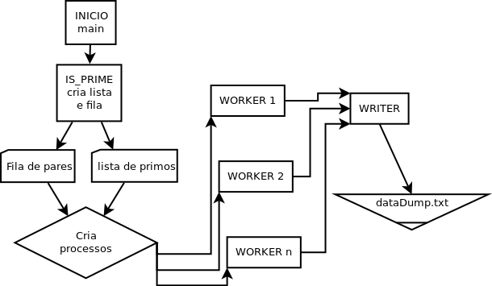

# UNIVERSIDADE DO ALGARVE

##2nd Assignement – Goldbach’s Conjecture

#### *Julio Jacobsen Dias*


Relatório do Trabalho Prático nº 2 de Sistemas Multi Agents
Mestrado em Engenharia Elétrica e Eletrônica

Trabalho efetuado sob a coordenação de:
*__Professor Doutor Pedro Cardoso__*

2017

***

##### Tabela de conteúdos

- Introdução
- Livrarias
- Diagrama
- O código
-- Calculo de primos
-- Conjecture
-- Fila de pares
-- Criando os processos
-- Guardar os cálculos
- Resultados
- Trabalhos futuros
- Bibliografia
- Código integro

***

## Introdução

_Todo numero par, a partir de 4, pode ser interpretado como sendo a soma de dois números primos._

Este problema foi proposto por Christian Goldbach, em correspondência, para Leonhard Euler, em 1742. Séculos depois este problema, que ficou conhecido como Goldbach's Conjecture, ainda não foi propriamente resolvido.

Graças a avanços tecnológicos, hoje podemos testar esta ideia de Goldbahc com facilidade. Já foi possível calcular que a conjectura é verdadeira para pares abaixo de 10^18 mas não se pode ter certeza do que vem depois ja que um limitador é também a nossa habilidade de calcular os primos a serem utilizados.

Nós faremos o código em Python e utilizaremos algumas livrarias que irão auxiliar a implementação do código. A principal destas livrarias será a "Multiprocessing". Mais sobre ela adiante.

Um exemplo de como o resultado pode ficar:

```
4 = 2 + 2

6 = 3 + 3

8 = 3 + 5

10 = 3 + 7, 5 + 5
```


** fonte: https://en.wikipedia.org/wiki/File:Goldbach_partitions_of_the_even_integers_from_4_to_50_rev4b.svg**

A Conjecture vai alem disso. Goldbach também fez a proposta de que números impares após 9 podem ser representados como a soma de 3 números primos. Este teorema nós não iremos investigar e ficaremos focados em como criar um algoritmo eficiente para o calculo dos pares.

***

## Livrarias

** Multiprocessing **
Esta livraria permite criar novos processos paralelos. Por defeito, o Pyhton não cria estes processos, precisando ter no próprio código as instruções para tal. Esta livraria tem a vantagem adicional de ser semelhante a outra livraria chamada "threading", que também é bem usada.

** Multiprocessing.Process**

Cria o processo paralelo do algoritmo. Precisa ser iniciado com o seu método start() e depois é fechado com join().
É necessário passar o método alvo, "target=", e o argumento, "args=", que sera passado, se qualquer um for.

** Multiprocessing.Pool**

Ele irá criar uma "piscina" de processos que serão distribuídos paralelamente entre os outros núcleos do processador. Os resultados finais serão entregues de maneira ordenada.
Não possui um equivalente na livraria "Threading".

** Multiprocessin.Array e Manager**

Uma das vantagens do Multiprocessing é que podemos criar variáveis com memoria dividida entre processos. Estas variáveis podem ser utilizada e atualizada ao mesmo tempo por vários processos.

Isto sera util para evitar que cada processo faça uma cópia da lista de valores primos, ocupando memoria desnecessariamente.

Ao invés de se usar o Array(), podemos usar também o método Manager(). Ele é mais lento que o Array mas é mais versátil. Ele pode suportar tipos: list, dict, Namespace, Lock, RLock, Semaphore, BoundedSemaphore, Condition, Event, Queue, Value and Array.

** Multiprocessing.JoinableQueue**

Sera usado uma fila especial do "Multiprocessing" que o permite colocar as tarefas em memoria compartilhada. Assim evitando o mesmo problema, que já discutimos com a lista de primos, de cada processo criar uma cópia e desperdiçar memoria.

Ao contrario da classe normal, "Queue()", a "JoinableQueue" possui os métodos "task_done()" e "join()".

- "Task_done()" sinaliza que uma tarefa retirada da fila foi concluída.

- "Join()" bloqueia o processo principal até que todas as tarefas nas filas estejam completas.

É bom chamar atenção estes dois métodos pois são importantes a frente.

** Math**

Da acesso as funções matemáticas como definidas pelo padrão da linguagem C.

***

## Diagrama



***

## Código

### Calculo de primos

Primeiramente precisaremos criar uma lista com os números primos necessários para testar a conjectura. Isso ira consumir tempo e processamento mas existem métodos para acelerar esta etapa.

##### Método simplificado utilizado:

No código final utilizei um método simples que não precisa de uma livraria a mais. 

No método, faremos uma verificação para termos certeza de que o numero não é par.

Em seguida faz-se um "for" que ira verificar se o numero é divisível mas apenas até a raiz quadrada para economizar tempo. Se for divisível o método retorna "Null", se não divisível retorna o numero.

``` Python
import math

def isPrime(num):
	# Se certificando de que o numero não é par.
	# Nao é estritamente necesserio mas ainda assim bom.
	assert (num % 2 != 0)
	# Checando se eh primo apenas ateh a raiz quadrada do numero testado.
    # Comesamos pelo 3 pois ja checamos o 2.
    for i in range(3, int(math.sqrt(num)) + 1, 2):
        if num % i == 0:
            return
    # Se tudo der certo, ele retorna o primo.
    else:
        return num
``` 

Esta forma de resolver o problema tem o defeito de retornar valores nulos para a lista. Para resolver isto o calculo a seguir resolve isto e adiciona o numero 2, único par primo, ao inicio da lista.

``` Python
# Remove os espasos vazius
primos = [x for x in primos if x != None]
# Um truque deselegante para colocar o unico primo par no começo da lista
primos.insert(0, 2)
```

##### Metodo Sieve:

Sieve de Eratosthenes é um algoritmo da Grécia antiga que itera sobre os números primos. O algoritmo busca os números primos e cria listas com os seus múltiplos. Esta maneira de calcular primos é mais eficiente para números menores.


** Fonte: https://en.wikipedia.org/wiki/Sieve_of_Eratosthenes**

``` Python
def sieveOfEratosthenes(n):
    """sieveOfEratosthenes(n): return the list of the primes < n."""
    if n <= 2:
        return []
    sieve = range(3, n, 2)
    top = len(sieve)
    for si in sieve:
        if si:
            bottom = (si*si - 3) // 2
            if bottom >= top:
                break
            sieve[bottom::si] = [0] * -((bottom - top) // si)
    return [2] + [el for el in sieve if el]
```
__ font: Mark Dickinson, http://groups.google.com/group/comp.lang.python/msg/f1f10ced88c68c2d__

##### Pool

Para agilizar o calculo dos primos, utilizaremos o método "Pool" da livraria "Multiprocessing".

```Python
from multiprocessing import Pool

pool = Pool(processes=4)
primos = pool.map(isPrime, range(3, n, 2))
pool.close()
```

Aqui criamos a Array com todos os valores primos que serão compartilhaods entre processos.

``` Python
from multiprocessing import Array

primos = Array('i', 0)
```

Aqui está um exemplo de como podemos usar o método Manager() para a mesma finalidade anterior.

``` Python
from multiprocessing import manager

manager = Manager()
primos = manager.list()
```

### Conjecture

Todo par pode ser representado como a soma de dois primos.

Primeiramente, o algoritmo faz um "for" com os primos. A cada iteração, faremos 4 verificações: Se o primo for maior que o par a operação já pode parar. Se quando subtraído o primo do par o resultado é encontrado na lista de primos. Se o primo, valor da esquerda, é maior ou igual ao par menos o primo, valor da direita. E, por ultimo, se a o valor esquerdo for maior que o direito, saia do "for".

Esta ultima verificação é necessária apenas para evitar que o algoritmo escreva a mesma operação duas vezes. Ex: 10 = 3 + 7, 5 + 5, 7 + 3. No momento em que o valor esquerdo for maior que o direito podemos sair da operação.

``` Python
def Goldbach(par):
    # Iremos guardar os dados, em arquivo, para referencia mais tarde.
    file = open("dataDump.txt", "a")
    file.write("\n\n" + str(par) + " = ")

    for primo in primos:
        if primo > par:
            break
        if par - primo in primos:
            if primo <= par - primo:
                # print(str(primo) + " + " + str(par - primo))
                file.write(str(primo) + " + " + str(par - primo) + ", ")
            else:
                break
    file.close()
```

O algoritmo ira guardar os dados da operação em um arquivo de texto chamado "dataDump.txt".

### Fila de pares

Aqui é necessário criar uma fila com memoria compartilhada pois esta sera a fila de tarefas do algoritmos. Se cada processo copiar a sua não só desperdiçaria memoria mas também fariam exatamente as mesmas tarefas.

``` Python
from multiprocessing import JoinableQueue

pares = JoinableQueue()
for i in range(4, n, 2):
	pares.put(i)
```

### Criando os processos

Criamos os 4 processos, um para cada core do meu laptop, que são os "workers". Eles irão pegar as tarefas, pares, da fila e iniciarão o calculo da conjectura. O processo ira continuar enquanto a fila de tarefas não estiver vazia.

``` Python
from multiprocessing import Process

def worker():
	while not pares.empty():
		Goldbach(pares.get())
		pares.task_done()

# Cria os processos paralelos para realizar as tarefas.
if __name__ == "__main__":
    processos = []
    for i in range(4):
        # self.worker()
        p = multiprocessing.Process(target=worker, args=())
        processos.append(p)

    for p in processos:
        p.start()

    for p in processos:
        p.join()
```

### Guardar os cálculos

Código para criar o arquivo para guardar os dados é bem simples. Conforme os cálculos são feitos o arquivo é atualizado.

Os dados podem ser guardados em Banco de dados também mas optei por um arquivo de texto por ser mais fácil implementar.

``` Python
# Cria o arquivo onde guardaremos os dados.
file = open("dataDump.txt", "w")
file.write("Here we go.\n\n\n")
file.close()
```

***

## Resultados

##### Tempo

O método usado foi "Time" do próprio Unix. Ele divide o tempo de 3 maneiras. Real é o tempo total usado, incluindo tempo esperando. User é apenas tempo em que o CPU esta sendo usado, não inclui espera. Por últimos, o Sys, é o tempo gasto acessando o Kernel da maquina, realizando tarefas com o hardware, alocando memoria, etc.

Os testes foram criados usando 10,000 como limite.

** Teste 1**

É importante apontar que o computador usado possui apenas 4 núcleos de processamento. Neste primeiro teste usaremos apenas 4 processos. O tempo "user" é a soma do tempo gasto pelo cpu. Como o algoritmo espalha o seu processamento por vários núcleos, o tempo deles acaba sendo somado.

```
real	0m15.177s
user	0m58.708s
sys	 0m0.336s
```

** Teste 2**

Agora tentaremos com 10 processos. Estes processos serão divididos entre os núcleos e a troca de processo entre núcleos pode diminuir a eficiência do algoritmo. No entanto o tempo que a operação demora, "user", continua ser o mesmo.

```
real	0m15.659s
user	0m58.540s
sys	 0m0.364s
```

** Teste 3**

Mais um teste com 50 processos só por boa medida. Mais processos não significa uma operação mais rapida sem os nucleos ou processadores.

```
real	0m16.766s
user	0m58.776s
sys	 0m0.428s
```

** Teste 4**

Agora com 1 processo usando apenas um nucleo. O resultado é o dobro do tempo gasto.

```
real	0m30.761s
user	0m30.404s
sys	 0m0.368s
```

##### Memoria

** Teste 1**

No anexo, a seguir, vemos o consumo de memoria apenas para o calculo dos números primos. Os números primos são calculados com o uso do método “Pool.map()” da livraria Multiprocessing. Foram calculados números primos até 50,000 para criar o gráfico pois o processo é muito rápido.


** Teste 2**

Aqui segue o consumo do código como um todo. Alguns problemas seguem desta observação. O simples fato de estarmos coletando dados interfere com a velocidade do  processo. O numero de primos usados foram apenas até 10,000.


As medições de memoria foram feitas usando o comando "mprof" do "Memory Profiler" e "Matplotlib".

##### Configuração de sistema

Esta é a configuração de sistema, hardware e software, usados para os testes.

```
Memoria:  7,7 GiB
Processador: Intel® Core™ i7-3537U CPU @ 2.00GHz × 4
Graphics: Intel® Ivybridge Mobile 
OS: Ubuntu 16.04 LTS 64-bit
Disk: 729,9 GB, HD SATA
```

***

## Trabalhos futuros

A linguagem Python possui um balanço entre alto e baixo nível que a faz particularmente útil para solucionar problemas acadêmicos. Alem disso, é possível utilizara C ou C++ para operações que necessitam destas linguagem em particular, com relativa facilidade.

Eu acredito que seria possível expandir o algoritmo para utilizar mais livrarias, como NumPy e MySQLdb, para torná-lo mais eficiente. Ainda não testamos até onde podemos romper o limite do algoritmo e a própria linguagem.


***

## Bibliografia:
- http://stackoverflow.com/questions/2068372/fastest-way-to-list-all-primes-below-n/3035188#3035188
- https://docs.python.org/2/library/multiprocessing.html
- https://pt.slideshare.net/Anil1091/goldbach-conjecture-1822075
- http://stackoverflow.com/questions/41410706/goldbachs-conjecture-find-the-number-of-ways-an-even-number-can-be-written-as
- https://docs.python.org/3.5/tutorial/index.html
- https://pypi.python.org/pypi/memory_profiler
- https://en.wikipedia.org/wiki/Goldbach%27s_conjecture
- https://docs.python.org/3.5/library/math.html
- https://unix.stackexchange.com/questions/40694/why-real-time-can-be-lower-than-user-time


*****

## Código integro

``` python
import multiprocessing
import math
from multiprocessing import Process, Pool, Manager, Array
from multiprocessing import JoinableQueue

def isPrime(num):
    assert (num % 2 != 0)
    # Checando se eh primo apenas ateh a razi quadrada do numero.
    # Comesamos pelo 3 pois ja checamos o 2.
    for i in range(3, int(math.sqrt(num)) + 1, 2):
        if num % i == 0:
            return
    # Se tudo der certo, ele retorna o valor.
    else:
        return num

def Goldbach(par):

    file = open("dataDump.txt", "a")

    # print(str(par) + " = ")
    file.write("\n\n" + str(par) + " = ")

    for primo in primos:
        if primo > par:
            break
        if par - primo in primos:
            if primo <= par - primo:
                # print(str(primo) + " + " + str(par - primo))
                file.write(str(primo) + " + " + str(par - primo) + ", ")
            else:
                break

    file.close()

def worker():
    while not pares.empty():
        Goldbach(pares.get())
        pares.task_done()


if __name__ == "__main__":
    # O valor maximo que queremos usar
    n = 10000

    # Os valores primos que ficarao em uma lista compartilhada entre os processos.
    # Assim economizamos em memoria.
    # O metodo Manager() eh mais versatil embora mais lento que simplismente usar um Array.
    # manager = Manager()
    # primos = manager.list()

    # Tambem fiz com Array() "just because"
    primos = Array('i', 0)

    # Pool e um metodo simples de se dividir uma tarefa simples entre varios processos.
    # Aqui eles irao calcular os primos para nos.
    pool = Pool(processes=4)
    primos = pool.map(isPrime, range(3, n, 2))
    pool.close()

    # Forma mais ificiente que encontrei de colocar o 2 na lista de primos
    primos.insert(0, 2)

    # Remove os espasos vazius
    primos = [x for x in primos if x != None]

    # Print so para verificar se ta tudo certo.
    # Quando se usa o [:] no print de uma lista ele escreve a lista toda. Nao sei porque.
    # print(primos[:])

    # Os valores pares serao salvos em uma fila, "Queue",
    # e serao removidos comforme forem resolvidos pelos workers.
    pares = JoinableQueue()

    # Criando uma lista de pares
    for i in range(4, n, 2):
        pares.put(i)

    # Cria o arquivo onde guardaremos os dados.
    file = open("dataDump.txt", "w")
    file.write("Here we go.\n\n\n")
    file.close()

    # Cria os processos paralelos para realizar as tarefas.
    processos = []
    for i in range(4):
        # worker()
        p = multiprocessing.Process(target=worker, args=())
        processos.append(p)

    for p in processos:
        p.start()

    for p in processos:
        p.join()

```