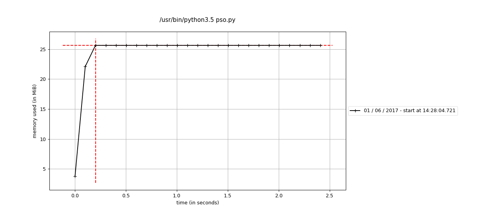

h
# UNIVERSIDADE DO ALGARVE

##3rd Assignement – Concurrent PSO

#### *Julio Jacobsen Dias*


Relatório do Trabalho Prático nº 3 de Sistemas Multi Agents
Mestrado em Engenharia Elétrica e Eletrônica

Trabalho efetuado sob a coordenação de:
*__Professor Doutor Pedro Cardoso__*

2017

***

##### Tabela de conteúdos

- Introdução
- Livrarias
- Diagrama
- Código
- Resultados
- Trabalhos futuros
- Bibliografia
- Código integro

***

## Introdução

O PSO, "particle swarm optimization", foi descoberto por James Kennedy e Russell Eberhart enquanto tentavam simular de maneira simples um modelo social. Buscando uma forma de interpretar os movimmentos de aves, e ou peixes, em grupos, acabaram por desenvolver uma maneira eficiente e robusta de optimização de algoritmos.

Parece algo simples mas muitos dos conceitos que guiam o desenvolvimento de inteligencia artificial hoje em dia provem  de pesquisas como estas. Facebook e Google estão hoje presos numa corrida para desenvolver produtos melhores criando sistemas que podem comunicar entre si e melhorar com o tempo e a coleta de dados. Principios do PSO.

O algoritmos irá busca em um plano, de quantas dimensões quiser, um local optimo. Como um grupo de abelhas buscando a melhor flor no jardim. Conforme as abelhas viajam voam pelo jardim, elas vão coletando dados sobre a sua posição e comunicando entre si. Todas elas sabem o mesmo que todas as outras. Assim, quando uma encontrar a solução, as outras a encontrarão também.

***

## Diagrama

Este é um exemplo de diagrama que encontrei na internet. Ele islustra bem como a operação do algoritmo funciona.


***
## Livrarias

** Multiprocessing **
Esta livraria permite criar novos processos paralelos. Por defeito, o Pyhton não cria estes processos, precisando ter no próprio código as instruções para tal. Esta livraria tem a vantagem adicional de ser semelhante a outra livraria chamada "threading", que também é bem usada.

** Multiprocessing.Process**

Cria o processo paralelo do algoritmo. Precisa ser iniciado com o seu método start() e depois é fechado com join().
É necessário passar o método alvo, "target=", e o argumento, "args=", que sera passado, se qualquer um for.

** Multiprocessin.Array, Valeu e Manager**

Uma das vantagens do Multiprocessing é que podemos criar variáveis com memoria dividida entre processos. Estas variáveis podem ser utilizada e atualizada ao mesmo tempo por vários processos.

Array() guarda uma array, ou lista, e Valeu() guarda um valor, "interger", "float" ou "double", de dados em memoria compartilhada. Assim cada partícula em cada ilha saberá qual é a localização do global best.

Ao invés de se usar o Array() ou Valeu(), podemos usar também o método Manager(). Ele é mais lento que o Array mas é mais versátil. Ele pode suportar tipos: list, dict, Namespace, Lock, RLock, Semaphore, BoundedSemaphore, Condition, Event, Queue, Value and Array.

** Random**

Esta livraria lida com a geração de números pseudo aleatórios. Será útil para nós criarmos posições aleatórias para as partículas e também para calcular o movimento das mesmas.

** Os**

Algumas funcionalidades que querermos usar são dependentes do sistema operacional. Esta livraria nos permite usar estas funcionalidade com facilidade através de seus métodos. Nós usaremos especificamente o método "getpid()" para ver qual é a identidade dos processos que estamos criando.

** NumPy**

Muito útil para fins científicos. O NumPy expande as possibilidades matemáticas do algoritmo com vários métodos de dicados a funcionar de maneira rápida.

***

## Código

Quando criarmos os processos, trataremos cada um como uma ilha de processamento. Isso fará com que tenhamos múltiplas "swarms" funcionando de maneira autônoma. Suas partículas viajarão por um plano bidimensional, comunicando entre si para encontrar o local best, e atualizar o global best se o local for melhor. É aqui que o método "Array()" do "Multiprocessing" entra, pois será uma "array", dividida entre os processo, que guardará o endereço do global best.

``` Python
if __name__ == "__main__":


	# Dados em memoria compartilhada
    # Estes dados serao compartilhados e atualizados pelas ilhas
    gb = Array('d', range(2))
    fgb = Value('d', 0)
    fgb.value += 10 ** 10

	# Lista com as ilhas
    islands = []

	# Criando as ilhas e objetos PSO
    for i in range(3):
        p = PSO(
            f,
            n=2,
            numero_particulas=50,
            eta1=2,
            eta2=2,
            xi=0.7289,
            numero_maximo_iteracoes=1000,
            p_id=i,
            gb=gb,
            fgb=fgb)

        islands.append(p)

	# Inicializa as ilhas
    for p in islands:
        p.start()

	# Encerra elas quando as operações acabam
    for p in islands:
        p.join()
```

Vamos definir o objeto PSO aqui. Assim já determinamos quais são os dados que definirão as ilhas de "swarm".

``` python
class PSO(Process):
    def __init__(self, f, n=2,
                 numero_particulas=20,
                 eta1=2, eta2=2, xi=.7289,
                 numero_maximo_iteracoes=10,
                 p_id=-1, gb=None, fgb=None
                 ):
        Process.__init__(self)
        self.f = f
        self.n = n
        self.xi = xi
        self.numero_particulas = numero_particulas
        self.eta1 = eta1
        self.eta2 = eta2
        self.numero_maximo_iteracoes = numero_maximo_iteracoes
        self.num_process = p_id  # PQ?
        self.gb = gb
        self.fgb = fgb
```

Aqui vamos rodar o processo propriamente dito. Começamos criando as partículas. Os processos irão se popular de partículas nesta primeira parte. Com forme a partícula é criada, em um local aleatório no plano, os dados sobre o ambiente são atualizado, global best e local best.

``` python
    def run(self):

        particulas = []

        gb = self.gb
        fgb = self.fgb

        # cria lista de particulas
        for p_id in range(self.numero_particulas):
            # cria a particula
            p = Particle(self.f, self.n, self.eta1, self.eta2)
            # adiciona a paritula a lista
            particulas.append(p)

            # atualiza o global best
            ppb, fppb = p.get_pb()
            if fppb < fgb.value:
                fgb.value = fppb  # f(posicao do global best)
                gb = list(ppb)  # posicao do global best
                id_bp = p_id  # indice da melhor particula

```

A classe "particle", criada pelo prof. Cardoso, é chamada para construir as partículas.

``` python
class Particle:
    def __init__(self, f, n=2, eta1=2, eta2=2, xi=.7289):
        self.f = f
        self.n = n
        self.eta1 = eta1
        self.eta2 = eta2
        self.xi = xi

        # inicializa a posicao da particula, velocidade e o valor de f(posicao)
        self.x = np.array([f.a + random.random() * (f.b - f.a) for _ in range(n)])
        self.v = np.array([f.a + random.random() * (f.b - f.a) for _ in range(n)])
        self.fx = self.f.f(self.x)

        # define/guarda o personal best da particula e o f(pb)
        self.pb = self.x
        self.fpb = self.fx
```

Este é o siclo principal, ainda dentro do método "run". Após criada as partículas, elas irão começar a se comunicar e a viajar pelo plano criado, buscando o "global best".

``` Python
		# main cycle
        for _ in range(self.numero_maximo_iteracoes):

            # para cada particual
            for p_id, p in enumerate(particulas):

                # for each particle do a step
                p.step(gb)

                # update the global best, if needed
                # aqui a função get_pd() faz um return dos valores da particula
                ppb, fppb = p.get_pb()

                # print('process id:', os.getpid())
                print(str(fgb.value) + " " + str(self.num_process) + " " + str(fppb))

                # Se o melhor da particula for maior que o global atual
                if fppb < fgb.value:
                    fgb.value = fppb
                    # gb é uma lista e estamos atualizando ela.
                    gb = list(ppb)
                    id_bp = p_id

                    # print(self.num_process)
                    # print(p_id, id_bp, particulas[id_bp], gb[:], fgb.value)
                    # print('process id:', os.getpid())
```

Dentro da própria classe "particle" existe o método "step()" que fará o calculo do movimento de cada partícula.

``` python
    def step(self, gb):
        # calcula a nova velocidade
        npgb = np.array(gb[:])
        self.v = self.v \
                 + self.eta1 * random.random() * (self.pb - self.x) \
                 + self.eta2 * random.random() * (npgb - self.x)

        # aplica fator de constricao
        self.v *= self.xi

        # atualiza a posicao da particular tendo em conta a posicao anterioe
        # e a velocidade
        self.x = self.x + self.v

        # verifica se não saiu do dominio/intervalo
        for i in range(self.n):
            if self.x[i] > self.f.b:
                self.x[i] = self.f.b
            elif self.x[i] < self.f.a:
                self.x[i] = self.f.a

        # calcula o novo valor da funcao objetivo
        self.fx = self.f.f(self.x)

        # atualiza o personal best
        if self.fpb > self.fx:
            self.pb = self.x
            self.fpb = self.fx

    def __repr__(self):
        return "x = " + str(self.x) \
               + "\t v = " + str(self.v) \
               + "\t f(x) = " + str(self.fx)
```

O métopdo f, do f3.py, determina os parametros do plano onde as particulas irão existir. Neste caso entre -2.048 a 2.048.

``` python
def domf():
    return a, b


def domfok(x):
    x = np.array(x)
    if np.all(x >= a) and np.all(x <= b):
        return True
    else:
        return False


def f(x):
    """
        Rosenbrock's valley (De Jong's function 2)
            global minimum
            f(x)=0; x(i)=1, i=1:n.
    """
    try:
        x = np.array(x)
        if np.isrealobj(x) and domfok(x):
                s1 = 0.0
                s2 = 0.0
                for i in range(x.__len__() - 1):
                    s1 += (x[i+1] - x[i] * x[i]) ** 2.0
                    s2 += (1.0 - x[i]) ** 2.0

                return 100 * s1 + s2
        else:
            raise Exception("Erro")
    except Exception as inst:
        if inst.__str__() == "Erro":
            print("o argumento nao pertence ao dominio: " + str(domf()))
        else:
            print(inst)
```

***

## Resultados

##### Tempo

O método usado foi "Time" do próprio Unix. Ele divide o tempo de 3 maneiras. Real é o tempo total usado, incluindo tempo esperando. User é apenas tempo em que o CPU esta sendo usado, não inclui espera. Por último, o Sys, é o tempo gasto acessando o Kernel da maquina, realizando tarefas com o hardware, alocando memoria, etc.

Neste caso serão 3 processos realizando a mesma tarefa e comunicando os resultados entre si. Mais processos não irão tornar o algoritmo mais rápido por esta razão. Pelo contrario na verdade. A memoria compartilhada será atualizada mais vezes, graças aos processos paralelos, e isto pode fazer com que o processamento de dados seja mais lento.

No entanto, os múltiplos processos tornarão o algoritmo mais eficiente, já que trabalharão em direção ao mesmo objetivo. Isto aumentara as chances de encontrarem o global best.

** Teste 1**

É importante apontar que o computador usado possuem apenas 4 núcleos de processamento. Neste primeiro teste usaremos apenas 3 processos, 3 ilhas. O tempo "user" é a soma do tempo gasto pelo cpu. Como o algoritmo espalha o seu processamento por vários núcleos, o tempo deles acaba sendo somado.

```
real	0m4.203s
user	0m10.816s
sys 	0m0.460s
```

** Teste 2**

O mesmo teste mas com apenas 1 processo para toda a operação. É interessante notar que, apesar de ter apenas um processo, o tempo real e sys não diminuíram de maneira proporcional.

```
real	0m2.613s
user	0m2.584s
sys	 0m0.332s
```

##### Memoria

** Teste 1**

A seguir o teste de memoria com processo único. Por ser apenas um processo o consumo de memoria será menor, alcançando apenas 25 MB de memoria.



** Teste 2**

A seguir teste de memoria com múltiplos processos. O consumo será maior pois, como foi dito antes, cada processo faz a mesma operação.

Somados os processos, alcançamos um consumo maximo entorno de 87 MB.


individualmente, os processos alcançam um máximo de 20 MB cada enquanto o processo principal fica em 25 MB, como no primeiro exemplo.


##### Configuração de sistema

Esta é a configuração de sistema, hardware e software, usados para os testes.

```
Memoria:  7,7 GiB
Processador: Intel® Core™ i7-3537U CPU @ 2.00GHz × 4
Graphics: Intel® Ivybridge Mobile 
OS: Ubuntu 16.04 LTS 64-bit
Disk: 729,9 GB, HD SATA
```

***

## Trabalhos futuros

Com a expansão do uso de inteligencia artificial, algoritmos capazes de encontrar soluções e comunicar entre si serão cada vez mais importante. É bem provável que este conceito, PSO, venha a informar, em muito, como os algoritmos usados para controle de trafego serão feitos no futuro. Especialmente por que humanos não irão dirigir mais.

Apesar de ser apenas uma algoritmo simples e de fácil implementação não significa que mais não pode ser apedido com ele. As perguntas sobre como organismos se organizam em sociedade ainda são relevantes e continuarão sendo.

Alem disto. Python é uma boa ferramenta para pesquisas embora ainda seja uma linguagem relativamente nova. Ainda assim a comunidade envolta da linguagem Python é grande e receptiva. Este projeto poderá ser otimizado futuramente com o uso de nova livrarias e novas soluções postas a frente pela comunidade. Como por exemplo a livraria Deap.

***

## Bibliografia:
- https://en.wikipedia.org/wiki/Particle_swarm_optimization
- https://docs.python.org/3.5/library/multiprocessing.html
- https://docs.python.org/3.5/library/random.html
- https://docs.python.org/3.5/library/os.html
- http://www.numpy.org/
- http://deap.readthedocs.io/en/master/examples/pso_basic.html
- https://gist.github.com/btbytes/79877
- http://www.geatbx.com/docu/fcnindex-01.html
- https://www.youtube.com/watch?v=DJJGnCuV5cI
- https://www.youtube.com/watch?v=bVDX_UwthZI
- https://www.youtube.com/watch?v=sB1n9a9yxJk
- http://www.kyu.edu.tw/volume/volume15/data/05-P93-116.pdf
- http://deap.readthedocs.io/en/master/examples/pso_basic.html
- https://www.cs.tufts.edu/comp/150GA/homeworks/hw3/_reading6%201995%20particle%20swarming.pdf
- https://stackoverflow.com/questions/38358881/how-to-profile-multiple-subprocesses-using-python-multiprocessing-and-memory-pro


*****

## Código integro

** pso.py**

``` python
from multiprocessing import Value, Process, Array
import os
from functions.particle import *
# from particle import *
import functions.f3 as f


class PSO(Process):
    def __init__(self, f, n=2,
                 numero_particulas=20,
                 eta1=2, eta2=2, xi=.7289,
                 numero_maximo_iteracoes=10,
                 p_id=-1, gb=None, fgb=None
                 ):
        Process.__init__(self)
        self.f = f
        self.n = n
        self.xi = xi
        self.numero_particulas = numero_particulas
        self.eta1 = eta1
        self.eta2 = eta2
        self.numero_maximo_iteracoes = numero_maximo_iteracoes
        self.num_process = p_id  # PQ?
        self.gb = gb
        self.fgb = fgb

    def run(self):

        particulas = []

        gb = self.gb
        fgb = self.fgb

        # cria lista de particulas
        for p_id in range(self.numero_particulas):
            # cria a particula
            p = Particle(self.f, self.n, self.eta1, self.eta2)
            # adiciona a paritula a lista
            particulas.append(p)

            # atualiza o global best
            ppb, fppb = p.get_pb()
            if fppb < fgb.value:
                fgb.value = fppb  # f(posicao do global best)
                gb = list(ppb)  # posicao do global best
                id_bp = p_id  # indice da melhor particula

        # print(id_bp, particulas[id_bp], gb, fgb)

        # main cycle
        for _ in range(self.numero_maximo_iteracoes):

            # para cada particual
            for p_id, p in enumerate(particulas):

                # for each particle do a step
                p.step(gb)

                # update the global best, if needed
                # aqui a função get_pd() faz um return dos valores da particula
                ppb, fppb = p.get_pb()

                # print('process id:', os.getpid())
                # print(str(fgb.value) + " " + str(self.num_process) + " " + str(fppb))

                # Se o melhor da particula for maior que o global atual
                if fppb < fgb.value:
                    fgb.value = fppb
                    # gb é uma lista e estamos atualizando ela.
                    gb = list(ppb)
                    id_bp = p_id

                    # print(self.num_process)
                    # print(p_id, id_bp, particulas[id_bp], gb[:], fgb.value)
                    # print('process id:', os.getpid())


if __name__ == "__main__":

    gb = Array('d', range(2))
    fgb = Value('d', 0)
    fgb.value += 10 ** 10

    # p = PSO(
    #             f,
    #             n=2,
    #             numero_particulas=50,
    #             eta1=2,
    #             eta2=2,
    #             xi=0.7289,
    #             numero_maximo_iteracoes=1000,
    #             p_id=1,
    #             gb=gb,
    #             fgb=fgb)
    #
    # p.run()

    islands = []

    for i in range(3):
        p = PSO(
            f,
            n=2,
            numero_particulas=50,
            eta1=2,
            eta2=2,
            xi=0.7289,
            numero_maximo_iteracoes=1000,
            p_id=i,
            gb=gb,
            fgb=fgb)

        islands.append(p)

    for p in islands:
        p.start()

    for p in islands:
        p.join()


```

** particle.py**

``` python
import random
import numpy as np


class Particle:
    def __init__(self, f, n=2, eta1=2, eta2=2, xi=.7289):
        self.f = f
        self.n = n
        self.eta1 = eta1
        self.eta2 = eta2
        self.xi = xi

        # inicializa a posicao da particula, velocidade e o valor de f(posicao)
        self.x = np.array([f.a + random.random() * (f.b - f.a) for _ in range(n)])
        self.v = np.array([f.a + random.random() * (f.b - f.a) for _ in range(n)])
        self.fx = self.f.f(self.x)

        # define/guarda o personal best da particula e o f(pb)
        self.pb = self.x
        self.fpb = self.fx

    def get_pb(self):
        return self.pb, self.fpb

    def step(self, gb):
        # calcula a nova velocidade
        npgb = np.array(gb[:])
        self.v = self.v \
                 + self.eta1 * random.random() * (self.pb - self.x) \
                 + self.eta2 * random.random() * (npgb - self.x)

        # aplica fator de constricao
        self.v *= self.xi

        # atualiza a posicao da particular tendo em conta a posicao anterioe
        # e a velocidade
        self.x = self.x + self.v

        # verifica se não saiu do dominio/intervalo
        for i in range(self.n):
            if self.x[i] > self.f.b:
                self.x[i] = self.f.b
            elif self.x[i] < self.f.a:
                self.x[i] = self.f.a

        # calcula o novo valor da funcao objetivo
        self.fx = self.f.f(self.x)

        # atualiza o personal best
        if self.fpb > self.fx:
            self.pb = self.x
            self.fpb = self.fx

    def __repr__(self):
        return "x = " + str(self.x) \
               + "\t v = " + str(self.v) \
               + "\t f(x) = " + str(self.fx)


if __name__ == "__main__":
    p = Particle(n=2)
    print(p)
    for _ in range(10):
        p.step(*p.get_pb())
        print(p)

```

** f3.py**

``` python
# -*- coding: utf-8 -*-
"""
Created on Tue Apr 26 08:47:37 2011
@author: pcardoso
"""
import numpy as np

a = -2.048
b = 2.048

print("""a carregar Rosenbrock's valley (De Jong's function 2)
        global minimum
        f(x)=0; x(i)=1, i=1:n.
    """)


def domf():
    return a, b


def domfok(x):
    x = np.array(x)
    if np.all(x >= a) and np.all(x <= b):
        return True
    else:
        return False


def f(x):
    """
        Rosenbrock's valley (De Jong's function 2)
            global minimum
            f(x)=0; x(i)=1, i=1:n.
    """
    try:
        x = np.array(x)
        if np.isrealobj(x) and domfok(x):
                s1 = 0.0
                s2 = 0.0
                for i in range(x.__len__() - 1):
                    s1 += (x[i+1] - x[i] * x[i]) ** 2.0
                    s2 += (1.0 - x[i]) ** 2.0

                return 100 * s1 + s2
        else:
            raise Exception("Erro")
    except Exception as inst:
        if inst.__str__() == "Erro":
            print("o argumento nao pertence ao dominio: " + str(domf()))
        else:
            print(inst)


def minf():
    return 0


if __name__ == "__main__":
    # exemplo de chamada a funcao
    print(f((0, 1, 2)))
    print(f([1, 2, 30]))
    print(f("[1, 1, 1]"))
    print(domf())

```